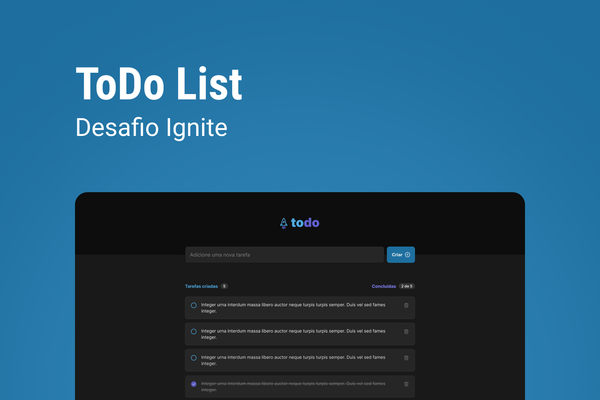

<p align="center">
  
</p>

---

<br><br>

# Desafio 1 - Ignite React JS

Demo: https://todo-list-app-wine.vercel.app/



O App para gerenciar as suas tarefas diária.

Esse projeto foi criado como projeto de conclusão do Desafio 01 do Ignite da [Rocketseat](https://rocketseat.com.br).

## Como instalar

Após clonar o projeto, acesse a pasta do projeto via terminal e rode o seguinte comando:


```bash
npm install
npm run dev 

```

## Recursos

- Adicionar Tarefas
- Marcar tarefas como concluídos
- Excluir Tarefas
- Progresso das Tarefas
- Salva as Tarefas no LocalStorage automaticamente


## Futuros Recursos

- Reordenar as Tarefas
- Modal com mais informações da Tarefa:
    - Prioridade
    - Data de Conclusão
    - Descrição
- Criação de Listas de Tarefas